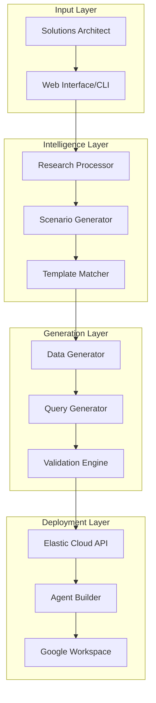

# Elastic Agent Builder Demo Platform

## 🚀 Automated Demo Generation for Elastic Solutions Architects

A powerful platform that enables Elastic Solutions Architects to create compelling, customized Agent Builder demonstrations in minutes rather than hours. This system leverages AI to research customers, generate relevant sample data, create working ES|QL queries, and automatically provision demo environments.

---

## 📋 Table of Contents

- [Overview](#overview)
- [Features](#features)
- [Quick Start](#quick-start)
- [Architecture](#architecture)
- [Examples](#examples)
- [Documentation](#documentation)
- [Contributing](#contributing)
- [License](#license)

---

## Overview

The Elastic Agent Builder Demo Platform transforms the manual process of creating customer demos into an automated, intelligent workflow. By combining LLM-powered customer research with synthetic data generation and query validation, Solutions Architects can create highly relevant, working demonstrations that resonate with specific customer needs.

### 🎯 Problem We Solve

Creating custom demos for enterprise customers traditionally requires:
- Hours of manual data preparation
- Complex ES|QL query writing and debugging
- Repetitive configuration of agents and tools
- Risk of queries failing during live demonstrations

### ✅ Our Solution

- **Intelligent Customer Research**: Automatically research companies and identify relevant use cases
- **Smart Data Generation**: Create realistic, interconnected datasets tailored to customer industries
- **Validated ES|QL Queries**: Generate and test queries before the demo
- **One-Click Provisioning**: Deploy complete demo environments with agents and tools configured

---

## Features

### 🤖 AI-Powered Intelligence
- **Customer Profiling**: Web research to understand company context and challenges
- **Use Case Matching**: Intelligent recommendation of relevant scenarios
- **Industry Templates**: Pre-built patterns for common verticals

### 📊 Data Generation Engine
- **Synthetic Data Creation**: Realistic datasets with proper relationships
- **Multi-Table Schemas**: Support for complex, joined data structures
- **Time-Series Support**: Historical data for trend analysis

### 🔍 ES|QL Query Builder
- **Syntax Validation**: Ensure queries work before demo
- **Auto-Fix Common Issues**: Handle integer division, field availability
- **Progressive Complexity**: Build from simple to complex queries

### 🚀 Deployment Automation
- **Elastic Cloud Integration**: Direct API provisioning
- **Agent Configuration**: Automatic tool and agent setup
- **Google Workspace Integration**: Generate presentations and spreadsheets

---

## Quick Start

### Prerequisites

- Python 3.8+
- Access to Elastic Cloud cluster with API key
- GitHub account with Personal Access Token (for state persistence)
- Anthropic or OpenAI API key (for AI features)

### Installation

#### 1. Clone and Setup

```bash
# Clone the repository
git clone https://github.com/elastic/demo-builder.git
cd demo-builder

# Run the setup script (recommended)
./setup.sh

# Or manual setup:
python3 -m venv venv
source venv/bin/activate  # On Windows: venv\Scripts\activate
pip install -r requirements.txt
cp .env.example .env
```

#### 2. Create GitHub Personal Access Token

For demo state persistence, create a GitHub PAT:

1. Go to GitHub → Settings → Developer settings → Personal access tokens → Fine-grained tokens
2. Click "Generate new token"
3. Configure:
   - **Expiration**: 90 days (recommended)
   - **Repository access**: Select `elastic/demo-builder`
   - **Permissions**:
     - **Contents**: `Read` and `Write` (required)
     - **Metadata**: `Read` (auto-selected)
4. Generate and copy the token immediately

#### 3. Configure Environment

Edit `.env` with your credentials:

```bash
# Elasticsearch Configuration
ELASTICSEARCH_HOST=your-elastic-cloud-url
ELASTICSEARCH_API_KEY=your-api-key

# LLM Configuration
ANTHROPIC_API_KEY=your-anthropic-key
# OR
OPENAI_API_KEY=your-openai-key

# GitHub Configuration (for state persistence)
GITHUB_TOKEN=ghp_xxxxxxxxxxxxxxxxxxxx
GITHUB_REPO=elastic/demo-builder
GITHUB_BRANCH=main
```

#### 4. Start the Application

```bash
# Activate virtual environment
source venv/bin/activate

# Run basic version
streamlit run app.py

# Or run enhanced version with validation
streamlit run app_enhanced.py
```

The app will open at `http://localhost:8501`

### Creating Your First Demo

1. **Open the Demo Builder**
   - Navigate to `http://localhost:8501` after starting the app
   - You'll see a conversation interface and progress tracker

2. **Provide Customer Context**
   - Enter company name and website
   - Specify target team/department
   - Describe business challenges or pain points

3. **AI-Assisted Scenario Generation**
   - The system researches the company
   - Suggests relevant use cases
   - Designs appropriate datasets and queries

4. **Validation & Testing**
   - Watch real-time task progress in the UI
   - Data is uploaded to Elasticsearch
   - ES|QL queries are validated automatically
   - See validation results before demo

5. **Export Demo Package**
   - Download demo guide (Markdown)
   - Get ES|QL queries and agent configuration
   - Access sample data files
   - All materials ready for your presentation

### Demo State Persistence

The platform saves your progress to GitHub, allowing you to:
- Resume demos later by entering the Demo ID
- Share demos with team members
- Track iterations and improvements
- Build a library of successful demos

---

## Architecture



### Key Components

#### 🔍 Customer Intelligence Module
- Web search integration for company research
- Industry analysis and pain point identification
- Use case recommendation engine

#### 🏗️ Scenario Builder
- Business scenario creation
- Dataset relationship mapping
- KPI and metric identification

#### 💾 Data & Query Pipeline
- Synthetic data generation with realistic distributions
- ES|QL query creation with proper syntax
- Query validation and debugging

#### 🚀 Demo Provisioner
- Elastic cluster setup and configuration
- Agent and tool creation via API
- Presentation material generation

---

## Examples

### Adobe Brand Asset Analytics Demo

A complete example demonstrating brand asset management across marketing campaigns:

- **289 brand assets** across multiple product lines
- **11,000+ campaign performance records** with ROI metrics
- **16,000+ usage events** tracking internal adoption
- **8 ES|QL query tools** for comprehensive analytics

[View Full Example](examples/adobe-demo/README.md)

### Key Files
- [Demo Guide](docs/demo-guide.md) - Complete walkthrough
- [ES|QL Queries](docs/esql-query-fixes.md) - Query templates
- [Data Generators](src/generators/) - Sample data creation

---

## Documentation

### 📚 Guides

- [Getting Started Guide](docs/getting-started.md)
- [Demo Setup Guide](docs/demo-setup-guide.md)
- [ES|QL Best Practices](docs/esql-best-practices.md)
- [Troubleshooting](docs/troubleshooting.md)

### 🛠️ API Reference

- [Data Generator API](docs/api/data-generator.md)
- [Query Builder API](docs/api/query-builder.md)
- [Agent Configuration](docs/api/agent-config.md)

### 📝 Templates

- [Industry Templates](templates/industries/)
- [Query Patterns](templates/queries/)
- [Agent Configurations](templates/agents/)

---

## Project Structure

```
demo-builder/
├── src/
│   ├── components/      # React components for data generation
│   ├── generators/       # HTML-based generator tools
│   ├── agents/          # Agent configuration modules
│   └── queries/         # ES|QL query templates
├── examples/
│   └── adobe-demo/      # Complete Adobe demo example
│       ├── data/        # Sample CSV files
│       └── queries/     # ES|QL queries
├── docs/                # Documentation
├── templates/           # Reusable templates
├── scripts/            # Automation scripts
└── tests/              # Test suites
```

---

## Contributing

We welcome contributions from the Elastic community! Please see our [Contributing Guide](CONTRIBUTING.md) for details on:

- Code standards and style guide
- Submitting pull requests
- Adding new industry templates
- Reporting issues

### Development Workflow

```bash
# Create a new branch
git checkout -b feature/your-feature

# Make changes and test
npm test
npm run lint

# Commit with conventional commits
git commit -m "feat: add new industry template"

# Push and create PR
git push origin feature/your-feature
```

---

## Roadmap

### Near Term (Q1 2025)
- [ ] Additional industry templates (Financial, Healthcare, Retail)
- [ ] Enhanced query validation with performance profiling
- [ ] Multi-language support for global teams
- [ ] Advanced agent orchestration patterns

### Medium Term (Q2-Q3 2025)
- [ ] Visual query builder interface
- [ ] Automated demo recording capabilities
- [ ] Performance benchmarking tools
- [ ] Integration with Elastic Observability

### Long Term (Q4 2025+)
- [ ] Self-learning system based on demo success metrics
- [ ] Predictive scenario generation
- [ ] Automated competitive analysis
- [ ] Full demo-to-POC automation

---

## Support

- **Documentation**: [docs.elastic.co/agent-builder](https://docs.elastic.co)
- **Issues**: [GitHub Issues](https://github.com/elastic/demo-builder/issues)
- **Slack**: #agent-builder-demos (internal)
- **Email**: sa-tools@elastic.co

---

## License

This project is licensed under the Elastic License 2.0. See [LICENSE](LICENSE) file for details.

---

## Acknowledgments

Special thanks to:
- The Elastic Agent Builder team for the powerful platform
- Solutions Architects who provided feedback and use cases
- The ES|QL team for query language improvements
- Adobe team for being an excellent pilot customer

---

## 🌟 Success Stories

> "Reduced demo prep time from 4 hours to 15 minutes. The customer was amazed by how specific the demo was to their use case." - *Solutions Architect, Enterprise*

> "The automated query validation saved me from an embarrassing failure during a critical demo." - *Senior SA, Financial Services*

> "Being able to generate industry-specific data made our POC incredibly compelling." - *Principal SA, Healthcare*

---

**Built with ❤️ by the Elastic Solutions Architecture Team**