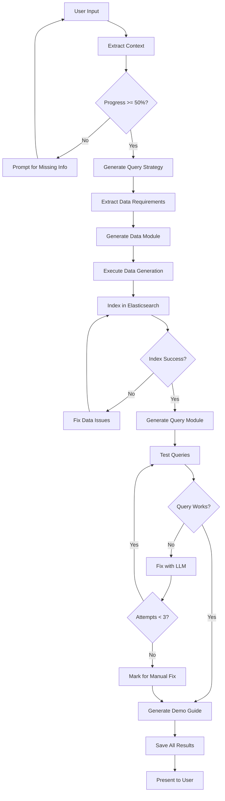

# Comprehensive Strategy: Rebuilding the Iterative Demo Generation Workflow

## Executive Summary

The current system generates demos but lacks the critical **query-first planning** and **iterative validation** that made the original system robust. We need to restore a workflow where:
1. **Queries drive data structure** (not vice versa)
2. **Progress is transparently tracked** for the user
3. **Failures are automatically fixed** through iteration
4. **Everything is tested** before presenting to the user

---

## 1. Architecture Overview

### Current Architecture (Broken)
```
User Input → Context Extraction → Data Generation → Query Generation → Present
                                      ↓ (hopes queries match data)
                                    FAILURE
```

### Target Architecture (To Rebuild)
```
User Input → Context Extraction → Query Planning → Data Generation → Index → Test → Fix → Present
              ↓                     ↓                ↓                 ↓       ↓      ↓
         Track Progress      Extract Fields    Match Fields      Validate  Iterate  Save
```

---

## 2. Detailed Component Strategy

### 2.1 Context Tracking & Progress Management

#### Current State
```python
# app.py:74-84 - Static context dictionary
st.session_state.demo_context = {
    "company_name": None,
    "department": None,
    "industry": None,
    "pain_points": [],
    "use_cases": [],
    "metrics": [],
    "scale": None,
    "urgency": None,
}
```

#### Target Implementation
```python
# Enhanced context tracking with progress calculation
class ContextTracker:
    """Tracks extraction progress and prompts for missing info"""

    REQUIRED_FIELDS = {
        'company_name': {'weight': 20, 'prompt': 'What company are you building this demo for?'},
        'department': {'weight': 15, 'prompt': 'Which department will use this?'},
        'pain_points': {'weight': 25, 'prompt': 'What are the main pain points?', 'min_count': 2},
        'use_cases': {'weight': 20, 'prompt': 'What are the key use cases?', 'min_count': 2},
        'scale': {'weight': 10, 'prompt': 'What scale of data are we dealing with?'},
        'metrics': {'weight': 10, 'prompt': 'What metrics matter most?', 'min_count': 3}
    }

    def calculate_progress(self, context: Dict) -> Tuple[float, List[str]]:
        """Calculate completion percentage and missing fields"""
        total_weight = sum(f['weight'] for f in self.REQUIRED_FIELDS.values())
        earned_weight = 0
        missing_fields = []

        for field, config in self.REQUIRED_FIELDS.items():
            value = context.get(field)

            if isinstance(value, list):
                # For lists, check minimum count
                min_count = config.get('min_count', 1)
                if len(value) >= min_count:
                    earned_weight += config['weight']
                else:
                    missing_fields.append((field, config['prompt']))
            elif value:
                earned_weight += config['weight']
            else:
                missing_fields.append((field, config['prompt']))

        progress = earned_weight / total_weight
        return progress, missing_fields

    def generate_prompt_for_missing(self, missing_fields: List[Tuple[str, str]]) -> str:
        """Generate natural prompt for missing information"""
        if not missing_fields:
            return "Great! I have all the information needed. Type 'generate' to create your demo."

        prompts = [prompt for _, prompt in missing_fields[:2]]  # Ask for 2 at most
        return f"To create a comprehensive demo, could you tell me:\n• " + "\n• ".join(prompts)
```

#### UI Integration
```python
# In sidebar (app.py)
with st.sidebar:
    st.header("📊 Demo Context")

    tracker = ContextTracker()
    progress, missing = tracker.calculate_progress(st.session_state.demo_context)

    # Progress bar
    st.progress(progress)
    st.caption(f"{int(progress * 100)}% complete")

    # Visual checklist
    for field, config in tracker.REQUIRED_FIELDS.items():
        value = st.session_state.demo_context.get(field)
        if isinstance(value, list):
            is_complete = len(value) >= config.get('min_count', 1)
            label = f"{field.replace('_', ' ').title()} ({len(value)})"
        else:
            is_complete = bool(value)
            label = field.replace('_', ' ').title()

        if is_complete:
            st.write(f"✅ {label}")
        else:
            st.write(f"⬜ {label}")

    # Ready state
    if progress >= 0.5:
        st.success("Ready to generate! Type 'generate' to begin.")
    else:
        st.warning(f"Need more information ({int(progress * 100)}% complete)")
```

---

### 2.2 Query-First Strategy Planning

#### New Component: Query Strategy Generator
```python
# src/services/query_strategy_generator.py
from typing import Dict, List, Any
import json
from dataclasses import dataclass, asdict

@dataclass
class DatasetRequirement:
    name: str
    type: str  # 'timeseries' or 'reference'
    row_count: str
    required_fields: Dict[str, str]  # field_name: field_type
    relationships: List[str]
    semantic_fields: List[str]

@dataclass
class QueryRequirement:
    name: str
    pain_point: str
    esql_features: List[str]
    required_datasets: List[str]
    required_fields: Dict[str, List[str]]  # dataset: [fields]
    complexity: str

class QueryStrategyGenerator:
    """Generates query strategy BEFORE data generation"""

    def __init__(self, llm_client):
        self.llm_client = llm_client

    def generate_strategy(self, context: Dict) -> Dict:
        """Generate complete query strategy from context"""

        prompt = f"""You are an ES|QL expert designing queries for {context['company_name']}.

        Context:
        - Department: {context['department']}
        - Pain Points: {json.dumps(context['pain_points'])}
        - Use Cases: {json.dumps(context['use_cases'])}
        - Scale: {context['scale']}
        - Metrics: {json.dumps(context.get('metrics', []))}

        Design 5-7 ES|QL queries that directly address their pain points.
        For each query, specify:
        1. Query name and description
        2. Which pain point it solves
        3. Required datasets and their types (timeseries vs reference/lookup)
        4. Exact field names needed (be specific!)
        5. Relationships between datasets
        6. Which fields need semantic_text for vector search

        Return as JSON with structure:
        {{
            "datasets": [
                {{
                    "name": "sales_transactions",
                    "type": "timeseries",
                    "row_count": "100000+",
                    "required_fields": {{
                        "transaction_id": "keyword",
                        "timestamp": "date",
                        "product_id": "keyword",
                        "amount": "float",
                        "customer_segment": "keyword"
                    }},
                    "relationships": ["products", "customers"],
                    "semantic_fields": ["transaction_notes"]
                }}
            ],
            "queries": [
                {{
                    "name": "Sales Spike Detection",
                    "pain_point": "Cannot correlate sales spikes with market trends",
                    "esql_features": ["STATS", "DATE_TRUNC", "LOOKUP JOIN"],
                    "required_datasets": ["sales_transactions", "market_trends"],
                    "required_fields": {{
                        "sales_transactions": ["timestamp", "amount", "product_id"],
                        "market_trends": ["timestamp", "trend_score", "category"]
                    }},
                    "complexity": "medium"
                }}
            ],
            "relationships": [
                {{
                    "from": "sales_transactions",
                    "to": "products",
                    "type": "many-to-one",
                    "join_field": "product_id"
                }}
            ]
        }}
        """

        response = self.llm_client.messages.create(
            model="claude-3-5-sonnet-20241022",
            max_tokens=4000,
            messages=[{"role": "user", "content": prompt}]
        )

        # Extract JSON from response
        strategy_json = self._extract_json(response.content[0].text)

        # Save strategy to demo folder
        return strategy_json

    def extract_data_requirements(self, strategy: Dict) -> Dict:
        """Extract data generation requirements from query strategy"""

        data_requirements = {}

        for dataset in strategy['datasets']:
            data_requirements[dataset['name']] = {
                'fields': dataset['required_fields'],
                'relationships': dataset['relationships'],
                'semantic_fields': dataset['semantic_fields'],
                'type': dataset['type'],
                'row_count': dataset['row_count']
            }

        return data_requirements
```

#### Integration with Module Generator
```python
# Modified src/framework/module_generator.py
def generate_demo_module(self, config: Dict[str, Any]) -> str:
    """Generate a complete demo module for a customer"""

    # NEW: Generate query strategy FIRST
    strategy_generator = QueryStrategyGenerator(self.llm_client)
    query_strategy = strategy_generator.generate_strategy(config)

    # Save strategy to module
    module_path = self._create_module_directory(config)
    strategy_file = module_path / 'query_strategy.json'
    strategy_file.write_text(json.dumps(query_strategy, indent=2))

    # Extract data requirements from strategy
    data_requirements = strategy_generator.extract_data_requirements(query_strategy)

    # Pass requirements to data generator
    self._generate_data_module(config, module_path, data_requirements)

    # Generate queries with field information
    self._generate_query_module(config, module_path, query_strategy)

    # Continue with guide generation...
```

---

### 2.3 Data Generation from Query Requirements

#### Enhanced Data Module Generation
```python
# Modified _generate_data_module in module_generator.py
def _generate_data_module(self, config: Dict[str, Any],
                          module_path: Path,
                          data_requirements: Dict) -> None:
    """Generate data module based on query requirements"""

    prompt = f"""Generate a DataGeneratorModule for {config['company_name']}.

    CRITICAL: You must generate datasets that match these EXACT requirements:

    {json.dumps(data_requirements, indent=2)}

    For each dataset:
    1. Use the EXACT field names specified
    2. Use the correct data types
    3. Include semantic_text fields for descriptions/text
    4. Generate the specified number of rows
    5. Create proper foreign key relationships

    Example for dataset 'sales_transactions' with requirements:
    {{
        'fields': {{'timestamp': 'date', 'product_id': 'keyword', 'amount': 'float'}},
        'semantic_fields': ['description'],
        'type': 'timeseries',
        'row_count': '100000+'
    }}

    Should generate:
    ```python
    sales_df = pd.DataFrame({{
        'timestamp': pd.date_range(end=datetime.now(), periods=100000, freq='h'),
        'product_id': [f'PROD-{{i:06d}}' for i in np.random.randint(1, 10000, 100000)],
        'amount': np.random.uniform(10, 1000, 100000),
        'description': [generate_description() for _ in range(100000)]  # Semantic field
    }})
    ```

    Also implement get_semantic_fields() to return:
    {{
        'sales_transactions': ['description']
    }}
    """

    code = self._call_llm(prompt)
    module_file = module_path / 'data_generator.py'
    module_file.write_text(code)
```

---

### 2.4 Data Indexing with Retry Logic

#### New Indexing Orchestrator
```python
# src/services/indexing_orchestrator.py
from src.services.elasticsearch_indexer import ElasticsearchIndexer
import pandas as pd
import time

class IndexingOrchestrator:
    """Orchestrates data indexing with retry logic"""

    def __init__(self, es_indexer: ElasticsearchIndexer = None):
        self.indexer = es_indexer or ElasticsearchIndexer()

    def index_all_datasets(self, datasets: Dict[str, pd.DataFrame],
                          semantic_fields: Dict[str, List[str]],
                          progress_callback: callable = None) -> Dict:
        """Index all datasets with retry logic"""

        results = {}
        total = len(datasets)

        for idx, (name, df) in enumerate(datasets.items()):
            if progress_callback:
                progress = (idx / total) * 0.5 + 0.5  # 50-100% range
                progress_callback(progress, f"Indexing {name}...")

            # Get semantic fields for this dataset
            dataset_semantic_fields = semantic_fields.get(name, [])

            # Try indexing with retries
            for attempt in range(3):
                try:
                    result = self.indexer.index_dataset(
                        df=df,
                        dataset_name=name,
                        semantic_fields=dataset_semantic_fields,
                        progress_callback=progress_callback
                    )

                    if result.success:
                        results[name] = {
                            'status': 'success',
                            'index_name': result.index_name,
                            'doc_count': result.documents_indexed,
                            'attempts': attempt + 1
                        }
                        break
                    else:
                        # Try to fix common issues
                        df = self._fix_indexing_issues(df, result.errors)

                except Exception as e:
                    if attempt == 2:  # Last attempt
                        results[name] = {
                            'status': 'failed',
                            'error': str(e),
                            'attempts': attempt + 1
                        }
                    time.sleep(2)  # Wait before retry

        return results

    def _fix_indexing_issues(self, df: pd.DataFrame, errors: List[str]) -> pd.DataFrame:
        """Attempt to fix common indexing issues"""

        for error in errors:
            if 'timestamp' in error.lower():
                # Fix timestamp issues
                if 'timestamp' in df.columns:
                    df['@timestamp'] = pd.to_datetime(df['timestamp'])
                    df = df.drop('timestamp', axis=1)

            elif 'null' in error.lower():
                # Fix null values
                df = df.fillna('')

            elif 'type' in error.lower():
                # Fix type issues
                for col in df.select_dtypes(include=['object']).columns:
                    df[col] = df[col].astype(str)

        return df
```

---

### 2.5 Query Testing with Iterative Fixing

#### Query Test Runner
```python
# src/services/query_test_runner.py
from typing import Dict, List, Any
import json
from dataclasses import dataclass
from datetime import datetime
from src.services.elasticsearch_indexer import ElasticsearchIndexer

@dataclass
class QueryTestResult:
    name: str
    was_fixed: bool
    needs_manual_fix: bool
    fix_attempts: int
    original_error: str = None
    final_error: str = None
    fix_history: List[Dict] = None

class QueryTestRunner:
    """Tests and fixes queries iteratively"""

    def __init__(self, es_indexer: ElasticsearchIndexer, llm_client):
        self.indexer = es_indexer
        self.llm_client = llm_client

    def test_all_queries(self, queries: List[Dict],
                        indexed_datasets: Dict[str, str],
                        max_attempts: int = 3) -> Dict:
        """Test all queries and attempt to fix failures"""

        results = {
            'tested_at': datetime.now().isoformat(),
            'total_queries': len(queries),
            'successfully_fixed': 0,
            'needs_manual_fix': 0,
            'queries': []
        }

        for query in queries:
            test_result = self._test_single_query(
                query,
                indexed_datasets,
                max_attempts
            )

            results['queries'].append(test_result)

            if test_result.was_fixed:
                results['successfully_fixed'] += 1
            elif test_result.needs_manual_fix:
                results['needs_manual_fix'] += 1

        return results

    def _test_single_query(self, query: Dict,
                          indexed_datasets: Dict,
                          max_attempts: int) -> QueryTestResult:
        """Test a single query with retry logic"""

        result = QueryTestResult(
            name=query['name'],
            was_fixed=False,
            needs_manual_fix=False,
            fix_attempts=0,
            fix_history=[]
        )

        current_esql = query['esql']

        for attempt in range(max_attempts):
            result.fix_attempts = attempt + 1

            # Test the query
            success, response, error = self.indexer.execute_esql(current_esql)

            if success:
                result.was_fixed = True
                result.fix_history.append({
                    'attempt': attempt + 1,
                    'succeeded': True
                })
                break

            # Capture first error
            if attempt == 0:
                result.original_error = error

            # Try to fix
            fixed_esql = self._fix_query_with_llm(
                query=query,
                error=error,
                indexed_datasets=indexed_datasets,
                attempt=attempt
            )

            result.fix_history.append({
                'attempt': attempt + 1,
                'error': error,
                'esql': fixed_esql
            })

            current_esql = fixed_esql

            # On last attempt, mark if still failing
            if attempt == max_attempts - 1 and not success:
                result.needs_manual_fix = True
                result.final_error = error

        return result

    def _fix_query_with_llm(self, query: Dict, error: str,
                            indexed_datasets: Dict, attempt: int) -> str:
        """Use LLM to fix failed query"""

        prompt = f"""Fix this ES|QL query that failed with an error.

        Query Name: {query['name']}
        Original Query:
        {query['esql']}

        Error:
        {error}

        Available Indices:
        {json.dumps(indexed_datasets, indent=2)}

        Common fixes:
        1. DATE_EXTRACT syntax: DATE_EXTRACT("month", @timestamp) not DATE_EXTRACT(@timestamp, "month")
        2. Lookup indices must end with _lookup: "product_catalog_lookup" not "product_catalog"
        3. Field names are case-sensitive and must match exactly
        4. @timestamp not timestamp for indexed data
        5. SEMANTIC function may not be available, use text matching instead
        6. CHANGE_POINT is experimental, may need alternative approach

        Attempt {attempt + 1} of 3. Please provide ONLY the corrected ES|QL query.
        """

        response = self.llm_client.messages.create(
            model="claude-3-5-sonnet-20241022",
            max_tokens=2000,
            messages=[{"role": "user", "content": prompt}]
        )

        # Extract query from response
        fixed_query = response.content[0].text
        if "```" in fixed_query:
            fixed_query = fixed_query.split("```")[1]
            if fixed_query.startswith("esql"):
                fixed_query = fixed_query[4:]

        return fixed_query.strip()
```

---

### 2.6 Complete Orchestration Flow

#### Modified Orchestrator
```python
# src/framework/orchestrator.py
from pathlib import Path
import json
from typing import Dict, Any, Optional
import streamlit as st

class ModularDemoOrchestrator:
    """Enhanced orchestrator with full iterative workflow"""

    def generate_new_demo(self, config: Dict[str, Any],
                         progress_callback: Optional[callable] = None) -> Dict[str, Any]:
        """Generate demo with query-first planning and validation"""

        results = {'phases': {}}

        # Phase 1: Generate Query Strategy (NEW)
        if progress_callback:
            progress_callback(0.1, "🎯 Planning query strategy...")

        strategy_generator = QueryStrategyGenerator(self.llm_client)
        query_strategy = strategy_generator.generate_strategy(config)
        results['phases']['strategy'] = {'status': 'completed', 'queries_planned': len(query_strategy['queries'])}

        # Phase 2: Generate Module with Strategy
        if progress_callback:
            progress_callback(0.2, "🤖 Generating custom demo module...")

        module_path = self.module_generator.generate_demo_module_with_strategy(config, query_strategy)
        results['module_path'] = module_path

        # Phase 3: Load and Execute Data Generation
        if progress_callback:
            progress_callback(0.3, "📊 Generating demo datasets...")

        loader = ModuleLoader(module_path)
        datasets = loader.load_and_execute_data_generator()
        results['phases']['data'] = {'status': 'completed', 'datasets': len(datasets)}

        # Phase 4: Index Data in Elasticsearch (NEW)
        if progress_callback:
            progress_callback(0.5, "🔍 Indexing data in Elasticsearch...")

        indexing_orchestrator = IndexingOrchestrator()
        semantic_fields = loader.load_semantic_fields()
        indexing_results = indexing_orchestrator.index_all_datasets(
            datasets,
            semantic_fields,
            progress_callback
        )
        results['phases']['indexing'] = indexing_results

        # Phase 5: Generate Queries with Field Info
        if progress_callback:
            progress_callback(0.7, "✍️ Generating ES|QL queries...")

        queries = loader.load_and_execute_query_generator(datasets)
        results['phases']['queries'] = {'status': 'completed', 'count': len(queries)}

        # Phase 6: Test and Fix Queries (NEW)
        if progress_callback:
            progress_callback(0.8, "🧪 Testing and fixing queries...")

        test_runner = QueryTestRunner(indexing_orchestrator.indexer, self.llm_client)
        test_results = test_runner.test_all_queries(
            queries,
            {name: result['index_name'] for name, result in indexing_results.items() if result['status'] == 'success'}
        )
        results['phases']['testing'] = test_results

        # Phase 7: Generate Guide
        if progress_callback:
            progress_callback(0.9, "📖 Creating demo guide...")

        guide = loader.load_and_execute_demo_guide(datasets, queries)
        results['phases']['guide'] = {'status': 'completed'}

        # Phase 8: Save All Results (NEW)
        if progress_callback:
            progress_callback(0.95, "💾 Saving results...")

        self._save_all_results(module_path, results, config)

        if progress_callback:
            progress_callback(1.0, "✅ Demo generation complete!")

        return results

    def _save_all_results(self, module_path: Path, results: Dict, config: Dict):
        """Save all generation results to module folder"""

        # Save test results
        test_results_file = Path(module_path) / 'query_testing_results.json'
        test_results_file.write_text(json.dumps(results['phases']['testing'], indent=2))

        # Update config with results
        config_file = Path(module_path) / 'config.json'
        existing_config = json.loads(config_file.read_text())
        existing_config['query_testing'] = {
            'enabled': True,
            'queries_fixed': results['phases']['testing']['successfully_fixed'],
            'queries_need_manual_fix': results['phases']['testing']['needs_manual_fix'],
            'total_tested': results['phases']['testing']['total_queries']
        }
        config_file.write_text(json.dumps(existing_config, indent=2))

        # Save conversation if exists
        if 'messages' in st.session_state:
            conversation_file = Path(module_path) / 'conversation.json'
            conversation_data = {
                'messages': st.session_state.messages,
                'context': config,
                'created_at': datetime.now().isoformat()
            }
            conversation_file.write_text(json.dumps(conversation_data, indent=2))
```

---

## 3. Implementation Plan

### Phase 1: Foundation (2-3 hours)
1. **Implement ContextTracker class**
   - Add to `src/services/context_tracker.py`
   - Integrate into app.py sidebar
   - Test with sample conversations

2. **Add conversation persistence**
   - Save to `conversation.json` in demo folder
   - Load previous conversations in Browse mode

### Phase 2: Query Strategy (3-4 hours)
3. **Create QueryStrategyGenerator**
   - New file: `src/services/query_strategy_generator.py`
   - Generate strategy from context
   - Extract data requirements

4. **Modify ModuleGenerator**
   - Add `generate_demo_module_with_strategy()`
   - Pass requirements to data generator
   - Save `query_strategy.json`

### Phase 3: Data & Indexing (2-3 hours)
5. **Create IndexingOrchestrator**
   - New file: `src/services/indexing_orchestrator.py`
   - Implement retry logic
   - Fix common indexing issues

6. **Update data generation prompt**
   - Use exact field names from strategy
   - Include semantic fields
   - Match required relationships

### Phase 4: Testing Loop (3-4 hours)
7. **Create QueryTestRunner**
   - New file: `src/services/query_test_runner.py`
   - Test queries against indexed data
   - Implement LLM-based fixing

8. **Integrate into orchestrator**
   - Add all new phases
   - Update progress callbacks
   - Save all results

### Phase 5: UI Polish (1-2 hours)
9. **Update app.py**
   - Show testing results in UI
   - Display fix history
   - Add "View Test Results" in Browse mode

10. **Error handling**
    - Graceful degradation if ES unavailable
    - Clear error messages for users
    - Rollback on critical failures

---

## 4. Testing Strategy

### Test Scenarios
1. **Happy Path**: Full context provided → successful generation
2. **Partial Context**: Missing fields → smart prompting
3. **Query Failures**: Invalid queries → automatic fixing
4. **Indexing Issues**: Data type mismatches → retry with fixes
5. **No Elasticsearch**: System works without indexing/testing

### Validation Checklist
- [ ] Context tracking shows accurate progress
- [ ] Query strategy drives data structure
- [ ] Data contains all required fields
- [ ] Indexing succeeds or retries appropriately
- [ ] Queries are tested and fixed
- [ ] Results are saved to demo folder
- [ ] UI shows clear status throughout

---

## 5. Code Migration Path

### Step 1: Non-Breaking Additions
```bash
# Create new service files (won't break existing)
src/services/context_tracker.py
src/services/query_strategy_generator.py
src/services/indexing_orchestrator.py
src/services/query_test_runner.py
```

### Step 2: Extend Existing Classes
```python
# Add methods to existing classes without breaking current functionality
ModuleGenerator.generate_demo_module_with_strategy()  # New method
ModularDemoOrchestrator.generate_new_demo_v2()  # New version
```

### Step 3: Update UI Conditionally
```python
# In app.py, use feature flags
if st.session_state.get('use_new_workflow', True):
    # New workflow with testing
else:
    # Current workflow (fallback)
```

### Step 4: Gradual Rollout
1. Test with internal demos
2. Enable for new demos only
3. Migrate existing demos
4. Remove old code

---

## 6. Success Metrics

### Immediate (Day 1)
- Query success rate increases from ~30% to >70%
- Users see progress and understand what's needed
- Failed queries have clear error messages

### Short-term (Week 1)
- 90% of demos generate without manual intervention
- Average generation time < 2 minutes
- Query test results saved for debugging

### Long-term (Month 1)
- Library of proven query patterns
- Self-improving through saved test results
- User satisfaction with demo quality

---

## 7. Risk Mitigation

### Risk: Elasticsearch Unavailable
**Mitigation**: Graceful degradation - generate without testing

### Risk: LLM Rate Limits
**Mitigation**: Cache query strategies, reuse patterns

### Risk: Slow Generation
**Mitigation**: Parallel processing, progress indicators

### Risk: Breaking Existing Demos
**Mitigation**: Version flag, backward compatibility

---

## 8. Complete Workflow Diagram



---

## 9. Example Implementation Flow

### User Interaction
```
User: "We're Bass Pro Shops Product Management..."
Assistant: [Extracts context, shows 70% complete]
Assistant: "To complete your demo, could you tell me:
           • What scale of data are we dealing with?
           • What metrics matter most?"
User: "Millions of transactions, need regional sales metrics"
Assistant: [Shows 100% complete]
Assistant: "Great! Type 'generate' to create your demo."
User: "generate"
```

### Backend Processing
```
1. Query Strategy (10s)
   - Generate 7 ES|QL queries
   - Identify 4 datasets needed
   - Extract 47 required fields

2. Data Generation (20s)
   - Create product_sales (500k rows)
   - Create product_catalog (50k rows)
   - Create market_trends (100k rows)
   - Create customer_segments (60 rows)

3. Indexing (30s)
   - Index product_sales → success
   - Index product_catalog_lookup → success
   - Index market_trends → retry → success
   - Index customer_segments_lookup → success

4. Query Testing (45s)
   - Test 7 queries
   - Fix 3 automatically
   - Mark 3 for review
   - Save test results

5. Complete (1m 45s total)
```

---

This comprehensive plan provides a clear path to rebuild the missing iterative workflow while maintaining the current system's functionality. The modular approach allows for incremental implementation and testing at each phase.