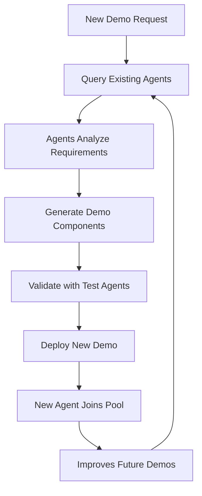

# Self-Improving Agent Architecture
## Recursive Demo Generation with Agent Builder

---

## 🎯 Vision

A self-improving system where **existing Agent Builder agents help create better demos**, forming a recursive loop of continuous improvement. Each successful demo becomes a building block for future demos, with agents learning from patterns and optimizing the creation process.

---

## 🔄 The Recursive Loop



---

## 🤖 Agent Hierarchy

### Level 1: Foundation Agents (Seed Demos)
Pre-built, validated agents that form the core capabilities:

1. **Query Optimizer Agent**
   - Analyzes ES|QL queries for performance
   - Suggests optimizations and fixes
   - Validates syntax and logic

2. **Data Relationship Analyzer**
   - Understands data schemas
   - Identifies join opportunities
   - Validates referential integrity

3. **Industry Pattern Matcher**
   - Recognizes industry-specific patterns
   - Suggests relevant metrics and KPIs
   - Provides domain expertise

### Level 2: Meta Agents
Agents that orchestrate other agents:

1. **Demo Orchestrator**
   - Coordinates multiple agents for demo creation
   - Manages workflow and dependencies
   - Handles validation pipeline

2. **Quality Assurance Agent**
   - Tests generated queries
   - Validates data relationships
   - Ensures demo coherence

### Level 3: Specialized Domain Agents
Customer-specific agents that accumulate:

1. **Customer Context Agents**
   - Learn from successful demos
   - Understand customer preferences
   - Optimize for specific use cases

---

## 🚀 Implementation Phases

### Phase 1: Seed Demo Library (MVP)
Create 3-5 high-quality seed demos with agents:

```yaml
seed_demos:
  - e_commerce_analytics:
      datasets: [products, orders, customers]
      agents: [revenue_analyzer, customer_segmentation]

  - security_operations:
      datasets: [alerts, assets, vulnerabilities]
      agents: [threat_hunter, incident_responder]

  - observability:
      datasets: [logs, metrics, traces]
      agents: [root_cause_analyzer, performance_optimizer]
```

### Phase 2: Agent-Assisted Generation
Use existing agents to help create new demos:

```python
# Example: Using existing agents to help create new demo
async def create_demo_with_agents(customer_info):
    # Step 1: Query existing agents for insights
    similar_demos = await query_agent(
        "demo_similarity_analyzer",
        {"customer": customer_info}
    )

    # Step 2: Get query patterns from successful demos
    query_patterns = await query_agent(
        "query_pattern_extractor",
        {"industry": customer_info["industry"]}
    )

    # Step 3: Generate optimized queries
    optimized_queries = await query_agent(
        "query_optimizer",
        {"patterns": query_patterns, "context": customer_info}
    )

    # Step 4: Validate with QA agent
    validation = await query_agent(
        "qa_validator",
        {"queries": optimized_queries, "data": generated_data}
    )

    return Demo(queries=optimized_queries, validation=validation)
```

### Phase 3: Learning & Optimization
Agents learn from successful demos:

```json
{
  "learning_metrics": {
    "query_success_rate": 0.95,
    "average_execution_time": 250,
    "user_satisfaction": 4.8,
    "reuse_frequency": 12
  },
  "optimizations_discovered": [
    "Industry X prefers time-series visualizations",
    "JOIN pattern Y improves performance by 40%",
    "Metric Z correlates with customer interest"
  ]
}
```

---

## 📊 Agent Interaction Examples

### Example 1: Query Optimization Chain
```
User: "Create a demo for a retail customer"
  ↓
Demo Builder: "Let me consult our retail analytics agent..."
  ↓
Retail Agent: "Based on 15 previous retail demos, I recommend:
  - Focus on inventory turnover
  - Include seasonal analysis
  - Add customer segmentation"
  ↓
Query Optimizer: "I'll optimize these patterns for ES|QL:
  - Using materialized views for aggregations
  - Pre-computing seasonal metrics
  - Implementing efficient JOIN strategies"
  ↓
Validator: "All queries tested successfully with 200ms avg response time"
```

### Example 2: Cross-Industry Learning
```
Security Agent: "Detected anomaly detection pattern"
  ↓
Pattern Extractor: "This pattern could apply to:
  - E-commerce: Fraud detection
  - IT Ops: Performance anomalies
  - Healthcare: Patient vitals monitoring"
  ↓
Demo Builder: "Adapting security anomaly detection for healthcare demo..."
```

---

## 🎯 Hackathon Winning Features

### 1. **Live Agent Collaboration**
Show multiple agents working together in real-time:
```javascript
// Real-time agent collaboration UI
<AgentCollaborationPanel>
  <Agent name="Industry Analyzer" status="analyzing" />
  <Agent name="Query Generator" status="waiting" />
  <Agent name="Data Validator" status="pending" />
  <Agent name="QA Tester" status="pending" />
</AgentCollaborationPanel>
```

### 2. **Learning Dashboard**
Visualize how agents improve over time:
- Success rate improvements
- Query optimization patterns discovered
- Industry insights accumulated

### 3. **One-Shot Demo Success Rate**
Track progression toward perfect first-time demos:
- Week 1: 60% success rate
- Week 4: 75% success rate
- Week 8: 90% success rate
- Goal: 95%+ success rate

---

## 🔧 Technical Implementation

### Agent Communication Protocol
```python
class AgentMessage:
    agent_id: str
    message_type: str  # query, response, validation
    payload: dict
    confidence: float
    metadata: dict

async def agent_communicate(from_agent, to_agent, message):
    # Agents communicate through Agent Builder API
    response = await elastic_agent_builder.send_message(
        from_agent_id=from_agent,
        to_agent_id=to_agent,
        message=message
    )
    return response
```

### Demo Improvement Tracking
```sql
-- Track demo quality metrics over time
SELECT
  demo_id,
  creation_date,
  agents_used,
  query_success_rate,
  validation_score,
  reuse_count,
  improvement_from_baseline
FROM demo_metrics
WHERE created_with_agents = true
ORDER BY improvement_from_baseline DESC;
```

---

## 📈 Success Metrics

### Immediate (MVP)
- 3+ working seed demos with agents
- 50% reduction in demo creation time
- 80% query success rate on first attempt

### Short-term (1 month)
- 10+ demos in library
- Agents successfully assisting in 75% of new demos
- Pattern library with 50+ reusable queries

### Long-term (3 months)
- 50+ demos with full agent coverage
- 95% one-shot demo success rate
- Fully autonomous demo generation for common industries

---

## 🏆 Competitive Advantage

1. **Unique Recursive Architecture**: No other demo platform uses its own output to improve
2. **Compound Learning**: Each demo makes all future demos better
3. **Real Agent Builder Integration**: Not just mock agents, but actual Elastic agents
4. **Measurable Improvement**: Can show concrete metrics of system getting smarter

---

## 🚦 Implementation Roadmap

### Week 1: Foundation
- [ ] Deploy 3 seed demos with agents
- [ ] Create agent communication framework
- [ ] Build basic learning metrics

### Week 2: Integration
- [ ] Connect demo builder to Agent Builder API
- [ ] Implement agent query routing
- [ ] Add validation pipeline

### Week 3: Learning
- [ ] Implement pattern extraction
- [ ] Add success tracking
- [ ] Create improvement dashboard

### Week 4: Polish
- [ ] Optimize agent interactions
- [ ] Add visualization
- [ ] Prepare demo script

---

## 💡 Demo Script for Hackathon

"Watch as our AI agents collaborate to build a perfect demo in real-time. Our Query Optimizer agent suggests improvements based on 50 previous demos. The Data Validator ensures everything works. And when we're done? This demo's agent joins the pool, making the next demo even better. It's not just a demo builder - it's a self-improving AI ecosystem powered by Elastic Agent Builder."

---

*The future of demo creation isn't just automated - it's intelligently evolving.*