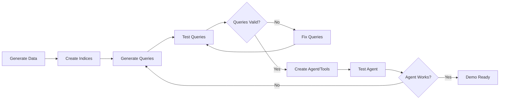

# End-to-End Test Strategy for Demo Builder
## Iterative Loop Validation

---

## 🎯 Objective

Prove that the complete demo generation loop works:
1. **Data Generation** → 2. **Index Creation** → 3. **Query Generation** → 4. **Validation** → 5. **Refinement** → 6. **Agent Creation** → 7. **Final Testing**

---

## 🔄 The Critical Loop



---

## 📋 Test Scenarios

### Scenario 1: Simple E-Commerce Analytics (Known Good)
**Purpose**: Baseline test with known working configuration

**Datasets**:
- `products` (100 records) - Lookup index
- `orders` (1000 records) - Standard index
- `order_items` (3000 records) - Standard index with foreign keys

**Relationships**:
- products → order_items (via product_id)
- orders → order_items (via order_id)

**Expected Queries**:
1. Total revenue by product
2. Top selling products
3. Order trends over time
4. Average order value by region

**Known Issues to Test**:
- Integer division (must use TO_DOUBLE)
- JOIN order (LOOKUP JOIN before STATS)
- Field availability after aggregation

### Scenario 2: Security Operations (Complex)
**Purpose**: Test complex relationships and time-series

**Datasets**:
- `assets` (50 records) - Lookup index
- `alerts` (5000 records) - Time-series events
- `vulnerabilities` (200 records) - Reference data

**Expected Challenges**:
- Time-based aggregations
- Multiple JOINs
- Percentile calculations

---

## 🧪 Test Implementation

### Phase 1: Data Generation Validation
```python
def test_data_generation():
    # Generate data
    assert all datasets have expected columns
    assert record counts match specification
    assert foreign key relationships exist
    assert no null values in required fields
    return datasets
```

### Phase 2: Index Creation Validation
```python
def test_index_creation():
    # Create indices with proper settings
    assert lookup index has "index.mode": "lookup"
    assert mappings are correct
    assert data is indexed successfully
    assert document counts match
    return index_names
```

### Phase 3: Query Generation & Validation
```python
def test_query_generation():
    # Generate queries
    for query in queries:
        result = execute_query(query)
        if error:
            fixed_query = apply_fixes(query, error)
            result = execute_query(fixed_query)
        assert result.success
        assert result.row_count > 0
    return validated_queries
```

### Phase 4: Query Refinement Loop
```python
def test_refinement_loop():
    issues = [
        "integer_division",
        "missing_field_after_stats",
        "join_after_aggregation"
    ]

    for issue in issues:
        bad_query = create_query_with_issue(issue)
        fixed_query = auto_fix_query(bad_query)
        assert validate_query(fixed_query)
```

### Phase 5: Agent & Tool Creation
```python
def test_agent_creation():
    # Create tools from queries
    tools = create_tools(validated_queries)

    # Create agent
    agent = create_agent(tools)

    # Test agent with sample questions
    test_questions = [
        "What are the top selling products?",
        "Show me revenue trends",
        "Which products have issues?"
    ]

    for question in test_questions:
        response = agent.query(question)
        assert response.success
        assert response.tool_used in tools
```

---

## 🔍 Validation Criteria

### Data Quality
- [ ] All foreign keys resolve
- [ ] Date ranges are consistent
- [ ] No duplicate IDs
- [ ] Realistic value distributions

### Index Configuration
- [ ] Lookup indices have correct mode
- [ ] Mappings match data types
- [ ] All indices are searchable

### Query Validity
- [ ] All queries execute without error
- [ ] Results are non-empty
- [ ] Execution time < 500ms
- [ ] Correct use of TO_DOUBLE for division

### Agent Functionality
- [ ] Agent selects appropriate tools
- [ ] Natural language queries work
- [ ] Results are accurate
- [ ] Error handling works

---

## 🚨 Common Failure Points to Test

1. **Integer Division**
   - Test: `value1 / value2`
   - Fix: `TO_DOUBLE(value1) / value2`

2. **JOIN After Aggregation**
   - Test: `STATS ... BY field | LOOKUP JOIN`
   - Fix: `LOOKUP JOIN | STATS ... BY field`

3. **Missing Fields After STATS**
   - Test: Using field not in BY clause
   - Fix: Include field in BY clause

4. **Lookup Index Not Set**
   - Test: JOIN fails
   - Fix: Recreate with "index.mode": "lookup"

---

## 📊 Success Metrics

- **Data Generation**: 100% of records generated with valid relationships
- **Index Creation**: All indices created with correct settings
- **Query Generation**: 90%+ queries work on first attempt
- **Query Refinement**: 100% of queries work after auto-fix
- **Agent Creation**: Agent responds correctly to 90%+ test questions
- **End-to-End Time**: < 60 seconds for complete demo

---

## 🔄 Iterative Improvement

Each test run should:
1. Log all failures with detailed error messages
2. Capture successful fix patterns
3. Update fix strategies based on new failure modes
4. Build a library of known good query patterns

---

## 🎯 Final Validation

The test is successful when:
1. Complete demo can be generated without manual intervention
2. All queries execute successfully against generated data
3. Agent can answer business questions using the tools
4. The entire process completes in under 60 seconds